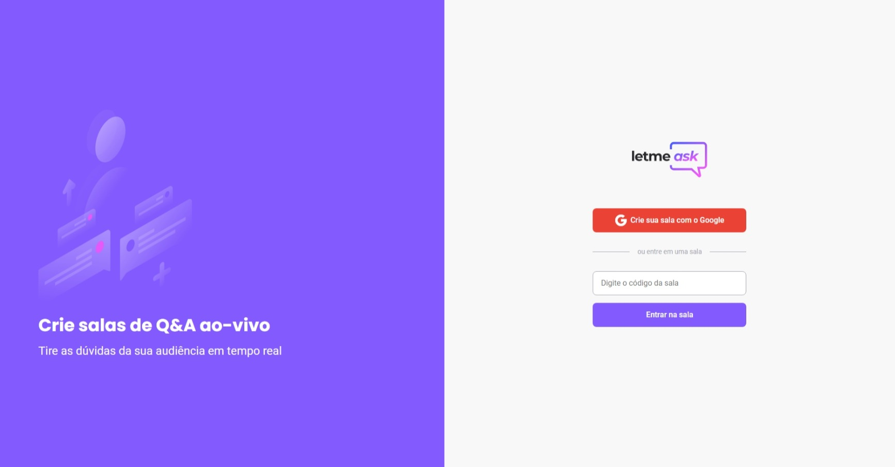
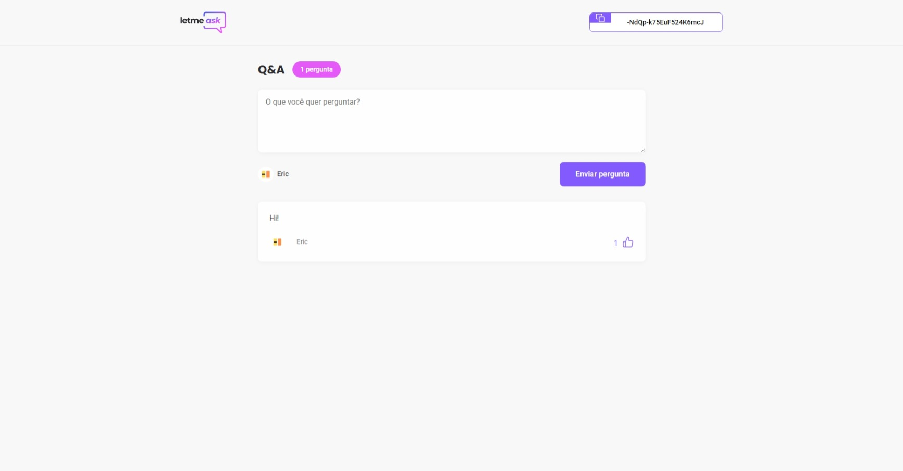

# Letmeask
## A real time Q&A web app
Project part of Bootcamp developed by [Rocketseat](https://github.com/Rocketseat)

Implemented using Typescript and Firebase.

### Usage

Run yarn install then yarn start.
Check the the [deployed wesbite](https://letmeask-35ba9.web.app/) 

### Specification

- Browser Routes: navigate to different routes
  
- Login: Users with existing accounts can log in to access their rooms and questions.
- Create Room: Users can create a new room, which will be a virtual space for discussions and questions.
- Join Room: Users can enter an existing room by providing the necessary room identifier or code.
- Type New Questions: Users can submit new questions relevant to the discussion or topic of the room.
- Like Questions: Users can express their interest or agreement with specific questions by liking them, providing a way to prioritize questions for discussion.
- Answer Questions: If a user has created the room, they have the capability to answer questions, providing valuable insights and responses.

- User Authentication: Firebase handles user authentication, ensuring secure access to rooms and questions.
- Real-time Database: Firebase's real-time database facilitates the dynamic updating of questions, likes, and responses as users interact with the web app.
- Hosting and Deployment: Firebase enables easy deployment and hosting of the web application, making it accessible to users across the internet.
- Data Storage: Firebase can be used to store room information, questions, and user data, ensuring data integrity and reliability. 
 
